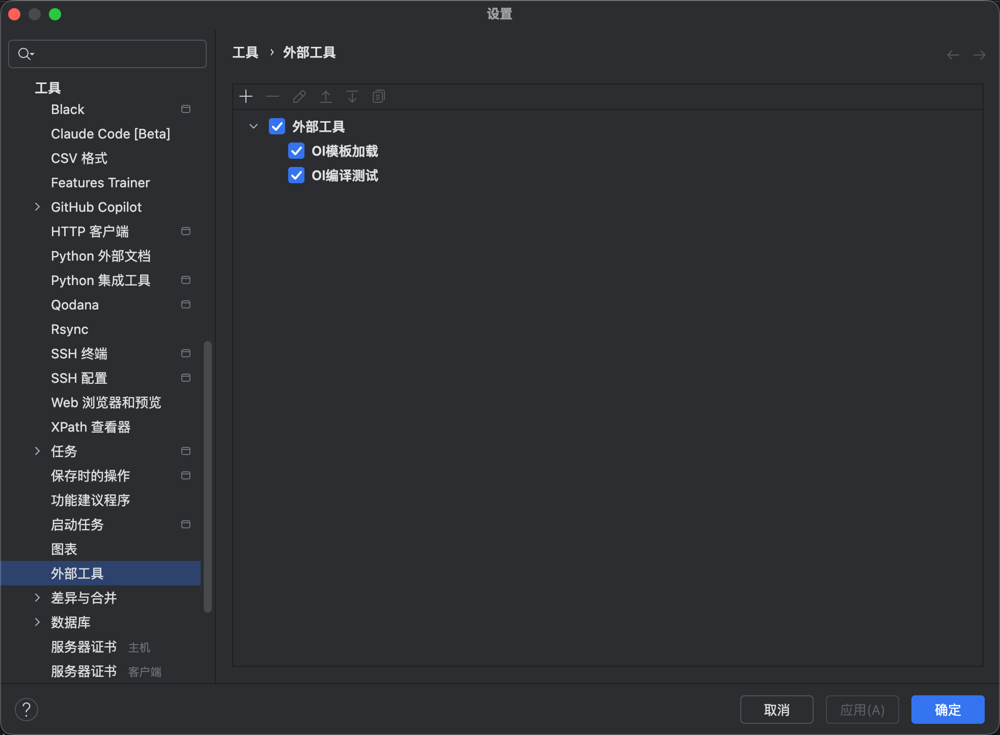
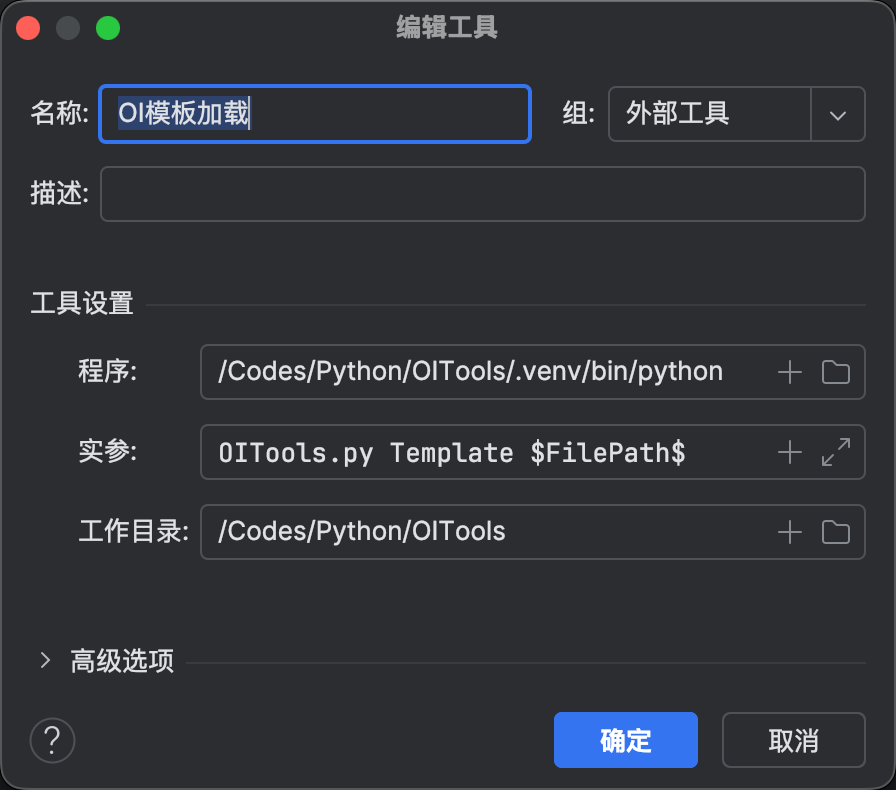
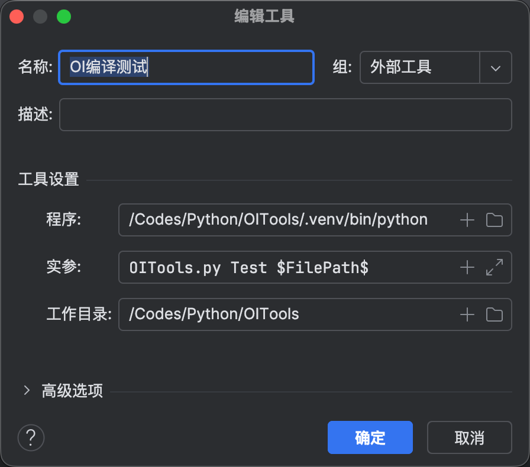
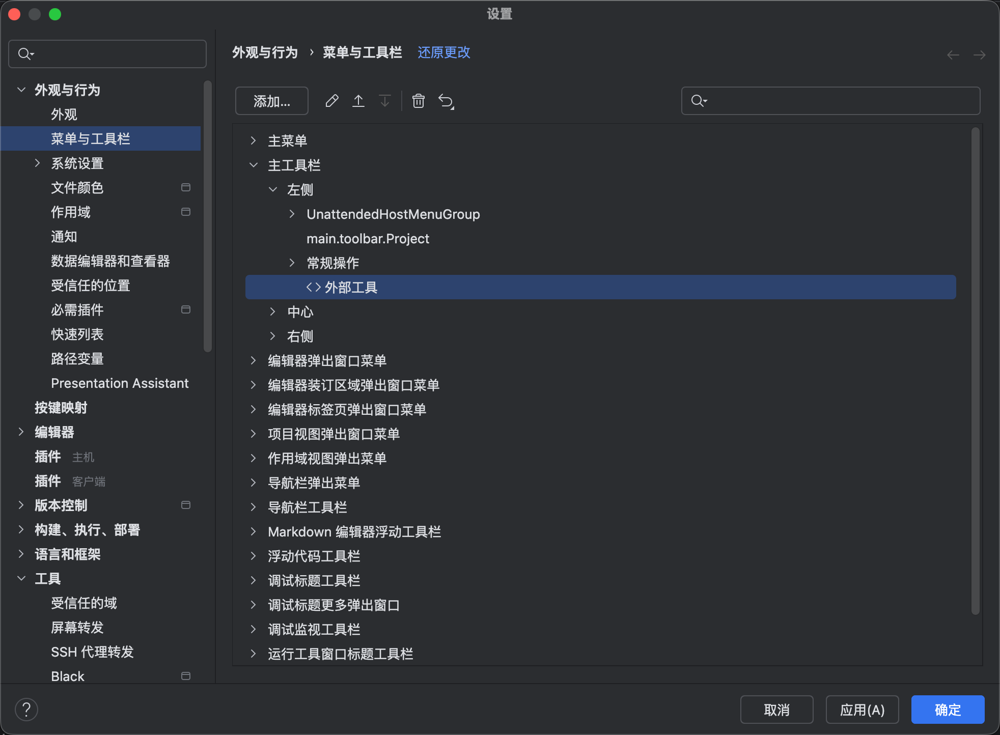
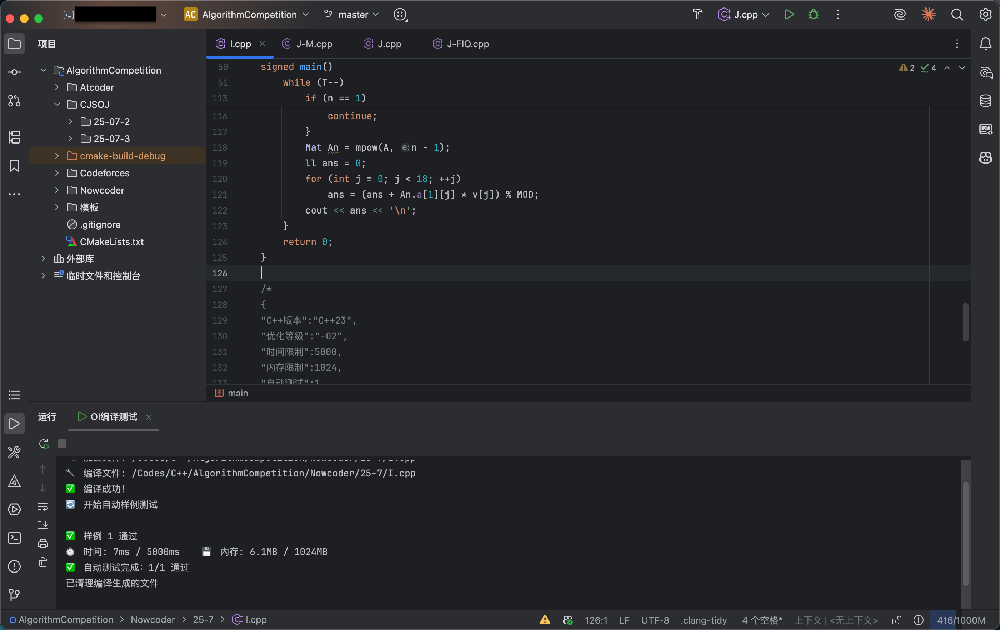

# OITools - Competitive Programming Assistant

[](https://www.python.org/)
[](https://opensource.org/licenses/MIT)
[](https://www.linux.org/)
[](./README.md)

A Python assistant tool designed for competitive programming (OI/ACM), providing C++ code template generation and automated testing functionality.

📖 English | [中文版](./README.md)

## ✨ Key Features

### 🚀 Template Generation (Template)
- **Standard Template**: Automatically generate C++ code templates that meet OI competition standards
- **Complete Configuration**: Includes common headers, optimization settings, and debug switches
- **Auto Information**: Adds timestamp, author information, and version control
- **One-Click Generation**: Create new problem files with simple commands

### 🧪 Automated Testing (Test)
- **Smart Compilation**: Automatically compile using g++, supporting C++11-C++23 standards
- **Configuration Parsing**: Read test configurations and samples from source file comments
- **Multiple Samples**: Support structured multi-group sample input/output testing
- **Resource Monitoring**: Real-time monitoring of program runtime and memory usage
- **Result Verification**: Intelligently compare program output with expected results, supporting precise/non-precise matching
- **Exception Handling**: Automatically detect and handle timeouts, memory overflow, program crashes, and other exceptions

### 🔧 Core Features

#### Configuration System
Support embedding JSON configuration in source file comments to flexibly control test parameters:

```cpp
/*
{
"C++Version":"C++23",
"OptimizationLevel":"-O2",
"TimeLimit":2000,
"MemoryLimit":256,
"AutoTest":1,
"ExactMatch":false
}
*/
```

#### Sample Format
Support intuitive structured sample input/output format:

```
<<2
1 2
3 4
>>2
3
7
```

#### Monitoring Features
- **Time Limit**: Millisecond-precise execution time monitoring
- **Memory Limit**: Real-time monitoring of RSS and VSZ memory usage
- **Process Isolation**: Child process execution to avoid main program crashes
- **Security Protection**: Comprehensive resource limits and exception handling mechanisms

## 📋 System Requirements

### Required Components
- **Python 3.x** - Main runtime environment
- **g++ Compiler** - C++ code compilation
- **Linux/Unix System** - Depends on /proc filesystem for resource monitoring

### Recommended Configuration
- Memory: 2GB+
- Storage: 1GB+

## 🚀 Installation Guide

### 1. Clone Project
```bash
git clone https://github.com/Alencryenfo/OITools.git
cd OITools
```

### 2. Set Permissions
```bash
chmod +x OITools.py
```

### 3. Verify Environment
```bash
# Check Python version
python3 --version

# Check g++ compiler
g++ --version

# Check if tool is available
python3 OITools.py
```

## 📖 Usage Guide

### Basic Command Format
```bash
python3 OITools.py <command> <file_path>
```

### 1. Generate Template
Create standard templates for new competitive programming problems:

```bash
# Create new problem file
python3 OITools.py Template solution.cpp
```

Generated template includes:
- Standard C++ competition headers
- Common type definitions (ll, ull)
- Input/output optimization
- Debug switches
- Configuration comment template
- Sample format examples

### 2. Run Tests
Perform automated testing on C++ code:

```bash
# Basic test
python3 OITools.py Test solution.cpp

# Test specific file
python3 OITools.py Test /path/to/your/code.cpp
```

Testing process:
1. **Configuration Parsing**: Read JSON configuration from file
2. **Sample Extraction**: Parse structured input/output samples
3. **Code Compilation**: Compile C++ code using g++
4. **Automated Testing**: Run sample tests one by one
5. **Result Verification**: Compare actual output with expected results
6. **Resource Monitoring**: Monitor runtime and memory usage
7. **Report Generation**: Display detailed test results

### CLion IDE Integration

- Add **External Tools** in project



- Configure tool command line





- Configure external tools to display in main menu bar for easy access



- Place the file that needs compilation/testing or template generation in IDE focus, use external tools for quick operations



## 📝 Configuration Details

### Configuration Parameter Description

| Parameter | Type | Default | Description |
|-----------|------|---------|-------------|
| `C++Version` | String | "C++23" | C++ standard version |
| `OptimizationLevel` | String | "-O2" | Compilation optimization level |
| `TimeLimit` | Integer | 2000 | Time limit (milliseconds) |
| `MemoryLimit` | Integer | 256 | Memory limit (MB) |
| `AutoTest` | Integer | 1 | Whether to enable automated testing |
| `ExactMatch` | Boolean | false | Whether to match output exactly |

### C++ Version Support
- C++11
- C++14
- C++17
- C++20
- C++23

### Optimization Level Options
- `-O0`: No optimization
- `-O1`: Basic optimization
- `-O2`: Standard optimization (recommended)
- `-O3`: Advanced optimization
- `-Ofast`: Fastest speed (may affect precision)

## 🧪 Sample Format

### Standard Format
```
<<InputLineCount
InputContent
>>OutputLineCount
OutputContent
```

### Complete Example
> First use this code to redirect output streams

```cpp
#ifdef DEBUG
    freopen("test.in", "r", stdin);
    freopen("test.out", "w", stdout);
#endif
```

> Then write configuration file in the last comment block
```cpp
/*
{
"C++Version":"C++23",
"OptimizationLevel":"-O2",
"TimeLimit":1000,
"MemoryLimit":128,
"AutoTest":1,
}
<<2
5 3
1 2 3 4 5
>>2
8
15
*/
```

### Multiple Sample Groups
```
<<1
3
>>1
6
<<2
1 2
3 4
>>2
3
7
```

## 📊 Test Results

### Success Example
```
🔧 Compile: g++ -std=c++23 -O2 -o solution solution.cpp
✅ Compilation successful

🧪 Starting automated testing...
📊 Sample 1:
  ⏱️ Time: 12ms
  💾 Memory: 2.1MB
  ✅ Passed

📊 Sample 2:
  ⏱️ Time: 8ms
  💾 Memory: 2.0MB
  ✅ Passed

🎉 Testing complete! All samples passed.
```

### Failure Example
```
🔧 Compile: g++ -std=c++23 -O2 -o solution solution.cpp
✅ Compilation successful

🧪 Starting automated testing...
📊 Sample 1:
  ⏱️ Time: 15ms
  💾 Memory: 2.1MB
  ❌ Wrong Answer
     Expected: 6
     Actual: 5

📊 Sample 2:
  ⏱️ Time: 2543ms
  💾 Memory: 2.0MB
  ⏰ Time Limit Exceeded (Limit: 1000ms)

❌ Testing complete, some samples failed.
```

## 🔧 Advanced Features

### Manual Test Mode
When `"AutoTest": 0` is set in configuration or sample format is invalid, the tool automatically switches to manual test mode:

```bash
📝 Please enter test data line count:
> 2
> Line 1: 5 3
> Line 2: 1 2 3 4 5

🧪 Running test...

Output result:
1
23
```

## 🤝 Contribution Guide

Issues and Pull Requests are welcome!

### Development Environment Setup
```bash
# Clone development version
git clone https://github.com/Alencryenfo/OITools.git
cd OITools

# Create development branch
git checkout -b feature/your-feature-name

# Run tests
python3 OITools.py Test sample_test.cpp
```

### Code Standards
- Use CamelCase naming convention
- Add detailed comment descriptions
- Follow Python PEP8 standards
- Ensure backward compatibility

## 📄 License

This project is licensed under the MIT License - see the [LICENSE](LICENSE) file for details.

## 🙏 Acknowledgments

- Thanks to all contributors for their support
- Designed based on OI/ACM competition standards
- Referenced design concepts from multiple open-source testing frameworks

## 📬 Join Discussion

- [Issues](https://github.com/Alencryenfo/OITools/issues)
- [Discussion](https://github.com/Alencryenfo/OITools/discussion)

---

**⭐ If this project is helpful to you, please consider giving it a star!**