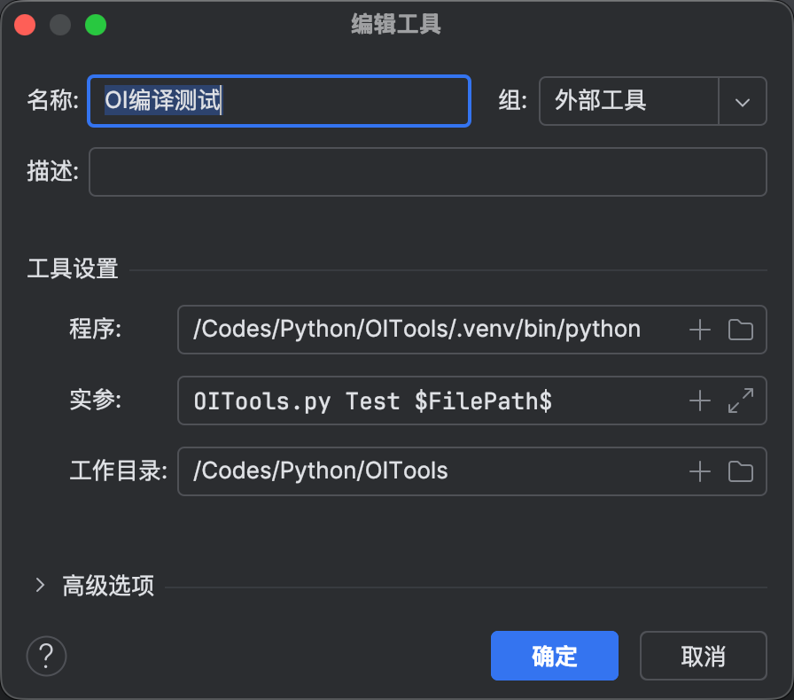
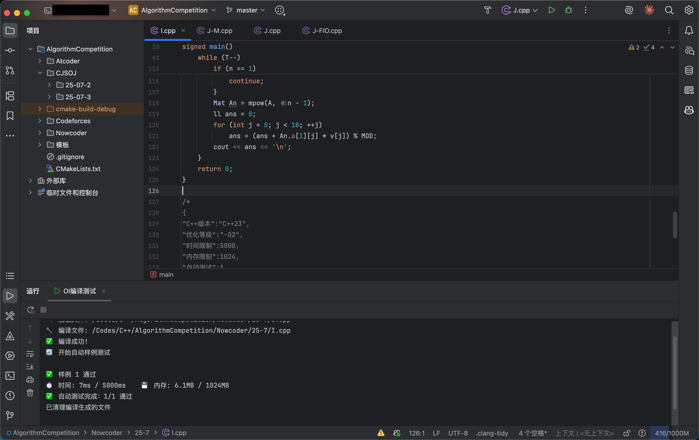

# OITools - 算法竞赛辅助工具

[](https://www.python.org/)
[](https://opensource.org/licenses/MIT)
[](https://www.linux.org/)
[](./README.en.md)

一个专为算法竞赛（OI/ACM）设计的Python辅助工具，提供C++代码模板生成和自动化测试功能。

📖 [English Version](./README.en.md) | 简体中文

## ✨ 主要特性

### 🚀 模板生成 (Template)
- **标准模板**: 自动生成符合OI竞赛标准的C++代码模板
- **完整配置**: 包含常用头文件、优化设置和调试开关
- **自动信息**: 添加时间戳、作者信息和版本控制
- **一键生成**: 简单命令即可创建新题目文件

### 🧪 自动化测试 (Test)
- **智能编译**: 自动使用g++编译，支持C++11-C++23标准
- **配置解析**: 从源文件注释中读取测试配置和样例
- **多组样例**: 支持结构化的多组样例输入输出测试
- **资源监控**: 实时监控程序运行时间和内存使用情况
- **结果验证**: 智能比较程序输出与预期结果，支持精准/非精准匹配
- **异常处理**: 自动检测并处理超时、内存溢出、程序崩溃等异常情况

### 🔧 核心特性

#### 配置系统
支持在源文件注释中嵌入JSON配置，灵活控制测试参数：

```cpp
/*
{
"C++版本":"C++23",
"优化等级":"-O2",
"时间限制":2000,
"内存限制":256,
"自动测试":1
}
*/
```

#### 样例格式
支持直观的结构化样例输入输出格式：

```
<<2
1 2
3 4
>>2
3
7
```

#### 监控功能
- **时间限制**: 精确到毫秒的执行时间监控
- **内存限制**: 实时监控RSS和VSZ内存使用
- **进程隔离**: 子进程执行，避免主程序崩溃
- **安全保护**: 完善的资源限制和异常处理机制

## 📋 系统要求

### 必需组件
- **Python 3.x** - 主要运行环境
- **g++ 编译器** - C++代码编译
- **Linux/Unix 系统** - 依赖/proc文件系统进行资源监控

### 推荐配置
- 内存: 2GB+
- 存储: 1GB+

## 🚀 安装指南

### 1. 克隆项目
```bash
git clone https://github.com/your-username/OITools.git
cd OITools
```

### 2. 设置权限
```bash
chmod +x OITools.py
```

### 3. 验证环境
```bash
# 检查Python版本
python3 --version

# 检查g++编译器
g++ --version

# 检查工具是否可用
python3 OITools.py
```

## 📖 使用方法

### 基本命令格式
```bash
python3 OITools.py <命令> <文件路径>
```

### 1. 生成模板
为新的算法题目创建标准模板：

```bash
# 创建新题目文件
python3 OITools.py Template solution.cpp
```

生成的模板包含：
- 标准C++竞赛头文件
- 常用类型定义（ll, ull）
- 输入输出优化
- 调试开关
- 配置注释模板
- 样例格式示例

### 2. 运行测试
对C++代码进行自动化测试：

```bash
# 基本测试
python3 OITools.py Test solution.cpp

# 测试特定文件
python3 OITools.py Test /path/to/your/code.cpp
```

测试流程：
1. **配置解析**: 读取文件中的JSON配置
2. **样例提取**: 解析结构化的输入输出样例
3. **代码编译**: 使用g++编译C++代码
4. **自动测试**: 逐个运行样例测试
5. **结果验证**: 比较实际输出与预期结果
6. **资源监控**: 监控运行时间和内存使用
7. **报告生成**: 显示详细的测试结果

### 使用 Clion 内部集成

- 在项目中添加**外部工具**


- 配置工具命令行




- 配置外部工具显示在主菜单栏便于调用


- 将需要编译测试或者需要生成模板的文件置于IDE焦点，使用外部工具进行快速操作



## 📝 配置详解

### 配置参数说明

| 参数 | 类型 | 默认值 | 说明 |
|------|------|--------|------|
| `C++版本` | String | "C++23" | C++标准版本 |
| `优化等级` | String | "-O2" | 编译优化级别 |
| `时间限制` | Integer | 2000 | 时间限制（毫秒） |
| `内存限制` | Integer | 256 | 内存限制（MB） |
| `自动测试` | Integer | 1 | 是否启用自动测试 |

### C++版本支持
- C++11
- C++14
- C++17
- C++20
- C++23

### 优化等级选项
- `-O0`: 无优化
- `-O1`: 基础优化
- `-O2`: 标准优化（推荐）
- `-O3`: 高级优化
- `-Ofast`: 最快速度（可能影响精度）

## 🧪 样例格式

### 标准格式
```
<<输入行数
输入内容
>>输出行数
输出内容
```

### 完整示例
> 先使用该代码重定向输出流

```cpp
#ifdef DEBUG
    freopen("test.in", "r", stdin);
    freopen("test.out", "w", stdout);
#endif
```

> 然后写入配置文件于最后一个注释块中
```cpp
/*
{
"C++版本":"C++23",
"优化等级":"-O2",
"时间限制":1000,
"内存限制":128,
"自动测试":1,
}
<<2
5 3
1 2 3 4 5
>>2
8
15
*/
```

### 多组样例
```
<<1
3
>>1
6
<<2
1 2
3 4
>>2
3
7
```

## 📊 测试结果

### 成功示例
```
🔧 编译: g++ -std=c++23 -O2 -o solution solution.cpp
✅ 编译成功

🧪 开始自动测试...
📊 样例 1:
  ⏱️ 时间: 12ms
  💾 内存: 2.1MB
  ✅ 通过

📊 样例 2:
  ⏱️ 时间: 8ms
  💾 内存: 2.0MB
  ✅ 通过

🎉 测试完成！所有样例通过。
```

### 失败示例
```
🔧 编译: g++ -std=c++23 -O2 -o solution solution.cpp
✅ 编译成功

🧪 开始自动测试...
📊 样例 1:
  ⏱️ 时间: 15ms
  💾 内存: 2.1MB
  ❌ 答案错误
     预期: 6
     实际: 5

📊 样例 2:
  ⏱️ 时间: 2543ms
  💾 内存: 2.0MB
  ⏰ 时间超限 (限制: 1000ms)

❌ 测试完成，有样例未通过。
```

## 🔧 高级功能

### 手动测试模式
当配置中设置 `"自动测试": 0` 或样例格式不合法时，工具会自动转为手动测试模式：

```bash
📝 请输入测试数据行数:
> 2
> 第一行: 5 3
> 第二行: 1 2 3 4 5

🧪 运行测试...

输出结果为：
1
23
```

## 🤝 贡献指南

欢迎提交Issue和Pull Request！

### 开发环境设置
```bash
# 克隆开发版本
git clone https://github.com/your-username/OITools.git
cd OITools

# 创建开发分支
git checkout -b feature/your-feature-name

# 运行测试
python3 OITools.py Test sample_test.cpp
```

### 代码规范
- 使用大驼峰命名法
- 添加详细的注释说明
- 遵循Python PEP8规范
- 确保代码向后兼容

## 📄 许可证

本项目采用 MIT 许可证 - 详见 [LICENSE](LICENSE) 文件。

## 🙏 致谢

- 感谢所有贡献者的支持
- 基于 OI/ACM 竞赛标准设计

## 📬 参与讨论

- [Issues]( https://github.com/Alencryenfo/OITools/issues)
- [Discussion](https://github.com/Alencryenfo/OITools/discussion)

---

**⭐ 如果这个项目对你有帮助，请考虑给个星标！**